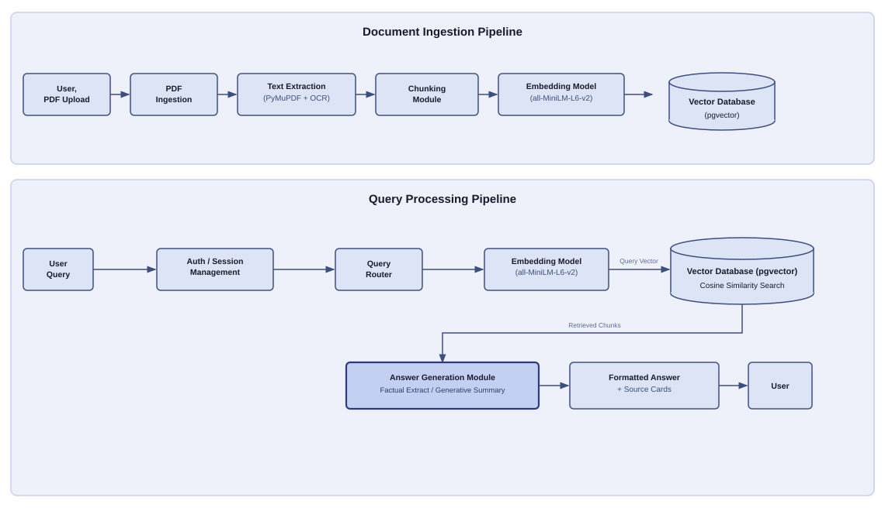

# Semantic-DocQuery
A full-stack application that enables users to upload documents (PDFs), perform semantic search, and retrieve context-aware answers with source references and similarity scores.

---
## System Architecture

```
Browser (React + Vite)
        │
        ▼
FastAPI Backend (REST APIs)
        │
        ├──  PDF Ingestion Pipeline
        │       ├── PyMuPDF (PDF Parsing)
        │       ├── OCR (Tesseract for scanned PDFs)
        │       ├── Noise Cleaner (remove headers, footers, artifacts)
        │       ├── Chunker (split into semantic chunks)
        │       ├── Embedder (MiniLM via sentence-transformers)
        │       └── pgvector (store embeddings in PostgreSQL)
        │
        ├──  Query Pipeline
        │       ├── Query Embedding
        │       ├── Cosine Similarity Search (pgvector)
        │       ├── Threshold Filtering
        │       ├── Extractive Summariser
        │       └── Response Builder (Answer + Source Cards)
        │
        ▼
PostgreSQL + pgvector
```

## System Architecture


  

---

##  Data Flow Summary

| Stage         | Input         | Output                |
| ------------- | ------------- | --------------------- |
| Upload        | PDF File      | Raw Document          |
| Parsing       | PDF           | Extracted Text        |
| OCR           | Scanned Pages | Machine-readable Text |
| Cleaning      | Raw Text      | Cleaned Text          |
| Chunking      | Clean Text    | Text Chunks           |
| Embedding     | Text Chunks   | Vector Embeddings     |
| Storage       | Embeddings    | Stored in pgvector    |
| Query Input   | User Query    | Query Vector          |
| Search        | Query Vector  | Top Matching Chunks   |
| Filtering     | Matches       | Relevant Chunks       |
| Summarisation | Chunks        | Final Answer          |
---

##  Data Flow 

                ┌──────────────┐
                │    User      │
                └──────┬───────┘
                       │
        ┌──────────────▼──────────────┐
        │   (P1) PDF Ingestion        │
        └──────────────┬──────────────┘
                       ▼
        ┌─────────────────────────────┐
        │ (P2) Text Extraction        │
        └──────────────┬──────────────┘
                       ▼
        ┌─────────────────────────────┐
        │ (P3) Chunking               │
        └──────────────┬──────────────┘
                       ▼
        ┌─────────────────────────────┐
        │ (P4) Embedding Model        │
        └──────────────┬──────────────┘
                       ▼
        ┌─────────────────────────────┐
        │ [D1] Vector Database        │
        └──────────────┬──────────────┘
                       ▲
                       │
        ┌──────────────┴──────────────┐
        │ (P7) Query Embedding        │
        └──────────────┬──────────────┘
                       ▲
        ┌──────────────┴──────────────┐
        │ (P6) Query Router           │
        └──────────────┬──────────────┘
                       ▲
        ┌──────────────┴──────────────┐
        │ (P5) Auth / Session         │
        └──────────────┬──────────────┘
                       ▲
                    [User]
                       │
                       ▼
        ┌─────────────────────────────┐
        │ (P8) Answer Generation      │
        └──────────────┬──────────────┘
                       ▼
        ┌─────────────────────────────┐
        │ (P9) Formatter              │
        └──────────────┬──────────────┘
                       ▼
                    [User]
---

# Implementation Details

## Backend Stack

| Library               | Version | Purpose                  |
| --------------------- | ------- | ------------------------ |
| FastAPI               | Latest  | API framework            |
| Uvicorn               | Latest  | ASGI server              |
| SQLAlchemy            | Latest  | ORM                      |
| pgvector              | Latest  | Vector similarity search |
| sentence-transformers | Latest  | Embedding model          |
| PyMuPDF               | Latest  | PDF parsing              |
| pytesseract           | Latest  | OCR                      |
| python-dotenv         | Latest  | Env management           |
| pydantic              | Latest  | Data validation          |

---

## Frontend Stack

| Library      | Version | Purpose    |
| ------------ | ------- | ---------- |
| React        | Latest  | UI library |
| React Router | Latest  | Routing    |
| Vite         | Latest  | Build tool |

---

## Infrastructure Choices

| Component       | Choice                | Reason                      |
| --------------- | --------------------- | --------------------------- |
| Database        | PostgreSQL + pgvector | Efficient vector similarity |
| Embedding Model | MiniLM                | Fast + lightweight          |
| Summarisation   | Extractive            | Preserves factual accuracy  |

---

# Project Structure

```
project-root/
│
├── backend/
│   ├── routers/
│   │   ├── authRouter.py
│   │   ├── chatRouter.py
│   │   ├── queryRouter.py
│   │   └── uploadRouter.py
│   ├── utils/
│   ├── uploads/
│   ├── main.py
│   ├── models.py
│   ├── schemas.py
│   ├── database.py
│   ├── requirements.txt
│   └── .env.example
│
├── frontend/
│   ├── src/
│   ├── public/
│   └── package.json
│__ sample-docs
└── README.md
---
```

# Setup & Installation

## Prerequisites

* Python (3.10+)
* Node.js (18+)
* PostgreSQL
* Tesseract OCR
* Poppler (for PDF processing)

---

##  Workflow

1. User uploads PDF
2. Text is extracted
3. Content is split into chunks
4. Embeddings are generated
5. Stored in vector DB
6. User query → embedding
7. Similar chunks retrieved
8. LLM generates response
---

## Database Setup

```sql
CREATE EXTENSION IF NOT EXISTS vector;
```
---

## Backend Setup

```bash
# Clone repo
git clone <your-repo-url>
cd backend

# Create virtual environment
python -m venv venv
source venv/bin/activate  # Windows: venv\Scripts\activate

# Install dependencies
pip install -r requirements.txt

# Setup environment variables
cp .env.example .env

# Run server
uvicorn main:app --reload
```

---

## Frontend Setup

```bash
cd frontend
npm install
npm run dev
```

---

# Security Notes

* No hardcoded credentials
* All secrets managed via `.env`
* Input validation using Pydantic
* Secure file handling

---

# Features

* Multi-document support
* Semantic search with similarity scoring
* Source attribution with page numbers
* OCR support for scanned PDFs
* Clean and modular architecture

---

# Future Enhancements

* Highlight relevant text in PDFs
* Add authentication & user dashboards
* Improve summarisation with LLMs
* Caching for faster query responses

---

# License
MIT License
